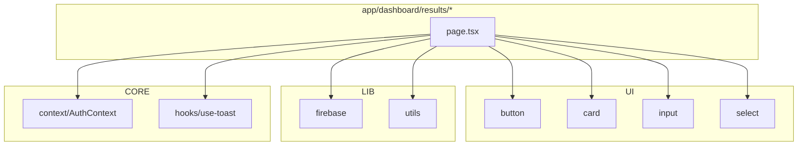
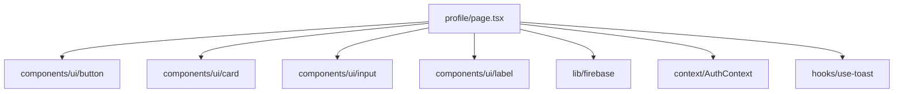
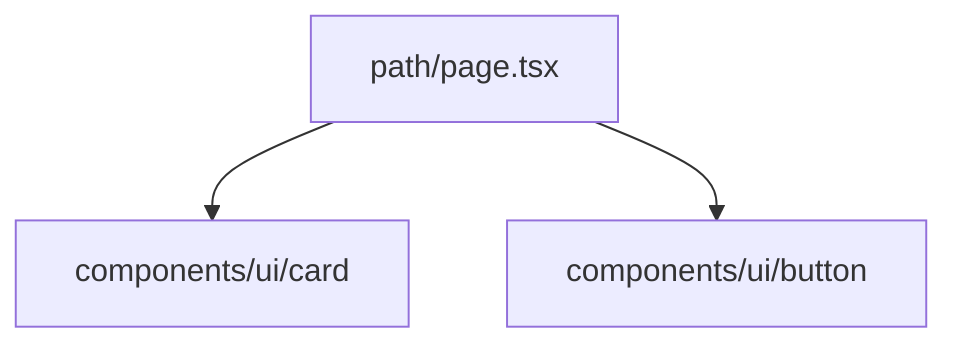
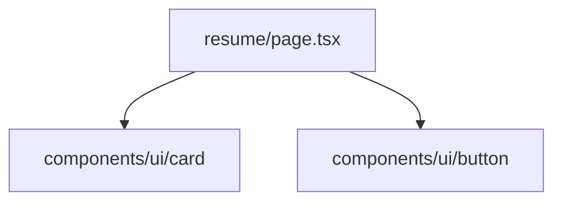
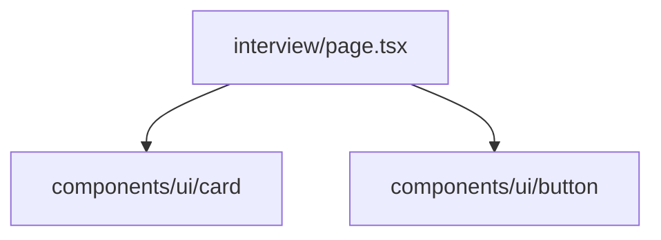
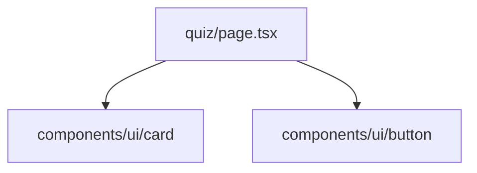
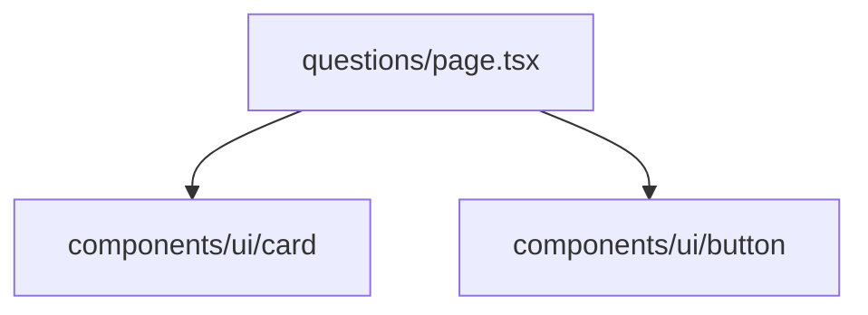

# Dependency Graphs (Key Subfolders)

This document provides Mermaid dependency graphs for all major features/routes, to visualize page-to-module and data dependencies at a glance. Keep updated as you evolve the codebase.


## app/student/dashboard/*
```mermaid
flowchart TD
  subgraph StudentDashboard[app/student/dashboard/*]
    S0[layout.tsx]
    S1[page.tsx]
    S2[submission/[id]/page.tsx]
  end

  subgraph UI[components/ui/*]
    U1[button]
    U2[card]
    U3[badge]
    U4[input]
  end

  subgraph LIB[lib/*]
    L1[firebase]
    L2[utils]
  end

  subgraph CORE
    C1[context/AuthContext]
    C2[hooks/use-toast]
  end

  S0 --> U2
  S1 --> L1
  S1 --> C1
  S1 --> U1
  S1 --> U2
  S1 --> U3
  S1 --> LIB
  S1 --> C2
  S2 --> L1
  S2 --> U2
  S2 --> U4
```


## app/dashboard/results/*



## app/student/profile/page.tsx



## app/student/skills/courses/page.tsx


## app/student/skills/path/page.tsx


## app/student/skills/resume/page.tsx


## app/student/skills/interview/page.tsx


## app/student/skills/quiz/page.tsx


## app/student/skills/questions/page.tsx


## app/student/skills/roadmap/page.tsx


## Overall app/* page-to-module map
```mermaid
flowchart TD
  subgraph Pages
    P1[dashboard/page.tsx]
    P2[dashboard/create/page.tsx]
    P3[dashboard/edit/[id]/page.tsx]
    P4[dashboard/results/page.tsx]
    P5[exam/[id]/page.tsx]
    P6[exam/[id]/verify/page.tsx]
    P7[exam/[id]/take/page.tsx]
    P8[student/dashboard/page.tsx]
    P9[student/dashboard/submission/[id]/page.tsx]
    P10[student/profile/page.tsx]
    P11[student/skills/page.tsx]
  end
  P1-->L[lib/firebase]
  P1-->U[components/ui/card]
  P2-->AI[ai/flows/generate-exam-questions.ts]
  P2-->L
  P2-->U
  P4-->L
  P4-->U
  P5-->L
  P5-->U
  P8-->L
  P8-->U
  P9-->L
  P9-->U
  P10-->L
  P10-->U
  P11-->L
  P11-->U
```

---
For further context and file responsibilities see `SRC_OVERVIEW.md` and `blueprint.md`. Add more graphs here as new feature folders/routes are added.
