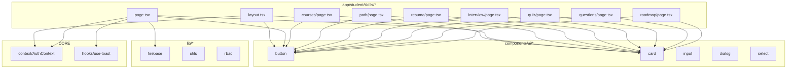

# Dependency Graphs (Key Subfolders)

This document provides Mermaid dependency graphs for important subfolders in the project, helping visualize page-to-module relationships.


## app/student/skills/*



## app/dashboard/*
```mermaid
flowchart TD
  subgraph Dashboard[app/dashboard/*]
    D0[layout.tsx]
    D1[page.tsx]
    D2[create/page.tsx]
    D3[edit/[id]/page.tsx]
    D4[results/page.tsx]
  end

  subgraph UI[components/ui/*]
    U1[button]
    U2[card]
    U3[input]
    U4[dialog]
    U5[select]
    U6[badge/table/etc.]
  end

  subgraph LIB[lib/*]
    L1[firebase]
    L2[utils]
    L3[rbac]
  end

  subgraph AI[ai/flows/*]
    A1[generate-exam-questions]
    A2[generate-exam-description]
  end

  subgraph CORE
    C1[context/AuthContext]
    C2[hooks/use-toast]
  end

  D0 --> UI
  D1 --> L1
  D1 --> C2
  D1 --> UI

  D2 --> A1
  D2 --> A2
  D2 --> L1
  D2 --> UI
  D2 --> C2

  D3 --> L1
  D3 --> UI
  D3 --> C2

  D4 --> L1
  D4 --> UI
  D4 --> C2
```


## app/exam/[id]/*
```mermaid
flowchart TD
  subgraph Exam[app/exam/[id]/*]
    E1[page.tsx (details/start)]
    E2[verify/page.tsx]
    E3[take/page.tsx]
  end

  subgraph UI[components/ui/*]
    U1[button]
    U2[card]
    U3[input]
    U4[checkbox]
    U5[skeleton]
  end

  subgraph LIB[lib/*]
    L1[firebase]
    L2[utils]
  end

  subgraph CORE
    C1[context/AuthContext]
    C2[hooks/use-toast]
  end

  E1 --> L1
  E1 --> C1
  E1 --> C2
  E1 --> U1
  E1 --> U2
  E1 --> U3
  E1 --> U4
  E1 --> U5

  E2 --> U1
  E2 --> U2

  E3 --> U1
  E3 --> U2
  E3 --> U3
  E3 --> U4
```


---
These diagrams are approximate and focus on high-level relationships. Keep them updated when adding new modules or changing imports.
