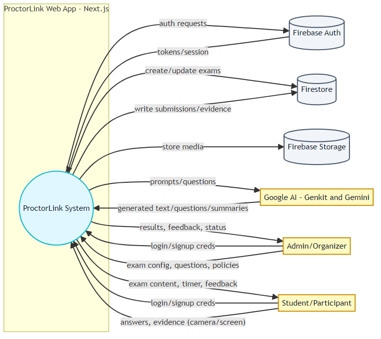
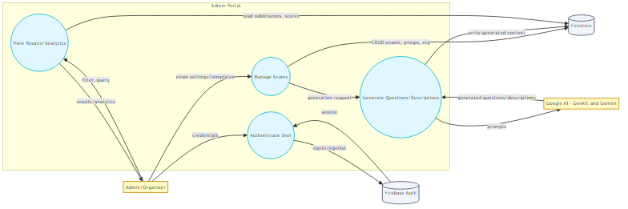
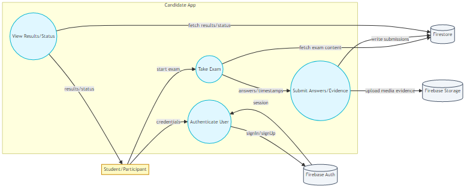
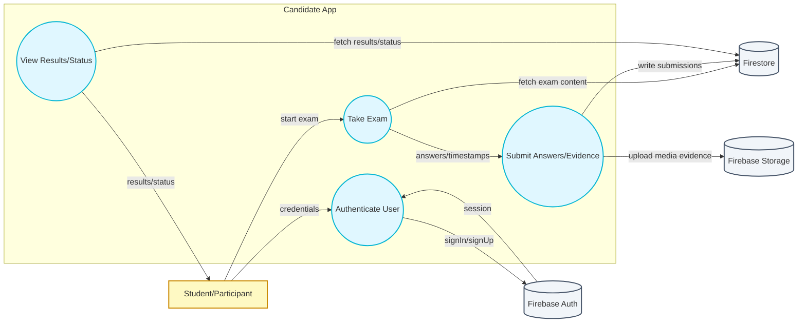
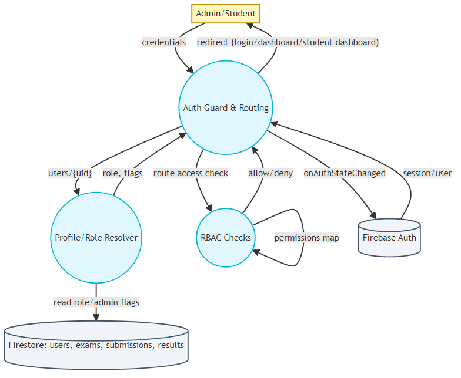
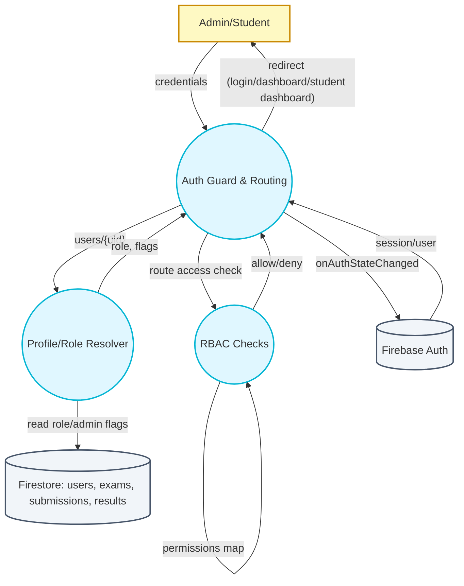

## Data Flow Diagrams (DFD)

This document provides DFDs for the ProctorLink application, showing key external entities, processes, data stores, and data flows.

### Level 0 – Context Diagram

Rendered images:
- PNG: 
- SVG: 

```mermaid
flowchart LR
  %% Styles
  classDef process fill:#e0f7ff,stroke:#06b6d4,stroke-width:2px,color:#0f172a
  classDef store fill:#f1f5f9,stroke:#475569,stroke-width:2px,color:#0f172a
  classDef ext fill:#fef9c3,stroke:#ca8a04,stroke-width:2px,color:#0f172a

  %% External Entities
  Admin[Admin/Organizer]:::ext
  Student[Student/Participant]:::ext
  GoogleAI[Google AI (Genkit/Gemini)]:::ext

  %% System Boundary
  subgraph ProctorLink Web App (Next.js)
    direction TB
    P0((ProctorLink System)):::process
  end

  %% Data Stores
  Auth[(Firebase Auth)]:::store
  DB[(Firestore)]:::store
  Storage[(Firebase Storage)]:::store

  %% Flows
  Admin -- login/signup creds --> P0
  Student -- login/signup creds --> P0
  P0 -- auth requests --> Auth
  Auth -- tokens/session --> P0

  Admin -- exam config, questions, policies --> P0
  P0 -- create/update exams --> DB

  Student -- answers, evidence (camera/screen) --> P0
  P0 -- write submissions/evidence --> DB
  P0 -- store media --> Storage

  P0 -- prompts/questions --> GoogleAI
  GoogleAI -- generated text/questions/summaries --> P0

  P0 -- results, feedback, status --> Admin
  P0 -- exam content, timer, feedback --> Student
```

### Level 1 – Admin Flows

Rendered images:
- PNG: 
- SVG: 

```mermaid
flowchart LR
  classDef process fill:#e0f7ff,stroke:#06b6d4,stroke-width:2px
  classDef store fill:#f1f5f9,stroke:#475569,stroke-width:2px
  classDef ext fill:#fef9c3,stroke:#ca8a04,stroke-width:2px

  Admin[Admin/Organizer]:::ext
  GoogleAI[Google AI (Genkit/Gemini)]:::ext

  subgraph Admin Portal
    A1((Authenticate User)):::process
    A2((Manage Exams)):::process
    A3((Generate Questions/Descriptions)):::process
    A4((View Results/Analytics)):::process
  end

  Auth[(Firebase Auth)]:::store
  DB[(Firestore)]:::store

  Admin -- credentials --> A1
  A1 -- signIn/signOut --> Auth
  Auth -- session --> A1

  Admin -- exam settings/templates --> A2
  A2 -- CRUD exams, groups, org --> DB

  A2 -- generation request --> A3
  A3 -- prompts --> GoogleAI
  GoogleAI -- generated questions/descriptions --> A3
  A3 -- write generated content --> DB

  Admin -- filter, query --> A4
  A4 -- read submissions, scores --> DB
  A4 -- results/analytics --> Admin
```

### Level 1 – Student Flows

Rendered images:
- PNG: 
- SVG: 



### Level 1 – Auth and Data Stores

Rendered images:
- PNG: 
- SVG: 



### Notes
- Auth: Firebase Auth via `onAuthStateChanged`, sessions managed client-side.
- Users/roles: Firestore `users/{uid}` holds role flags (`admin`, `role`), combined in the auth context.
- RBAC: Route-to-permission mapping enforced in UI (see `src/lib/rbac.tsx`).
- Data stores likely include collections: `users`, `exams`, `submissions`, `results` and media in Firebase Storage.
- AI integration: Genkit with Google AI (Gemini) for generating exam descriptions/questions.


