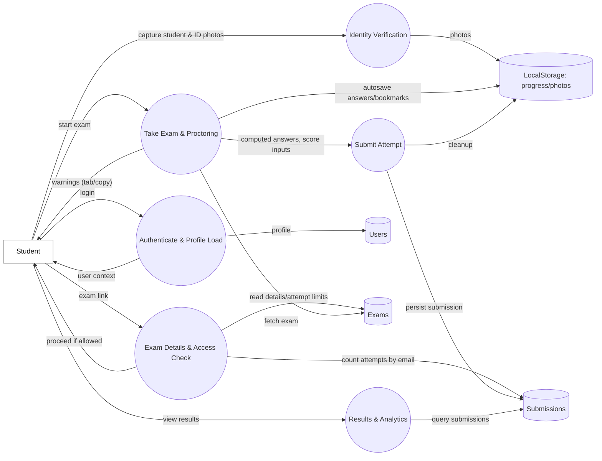
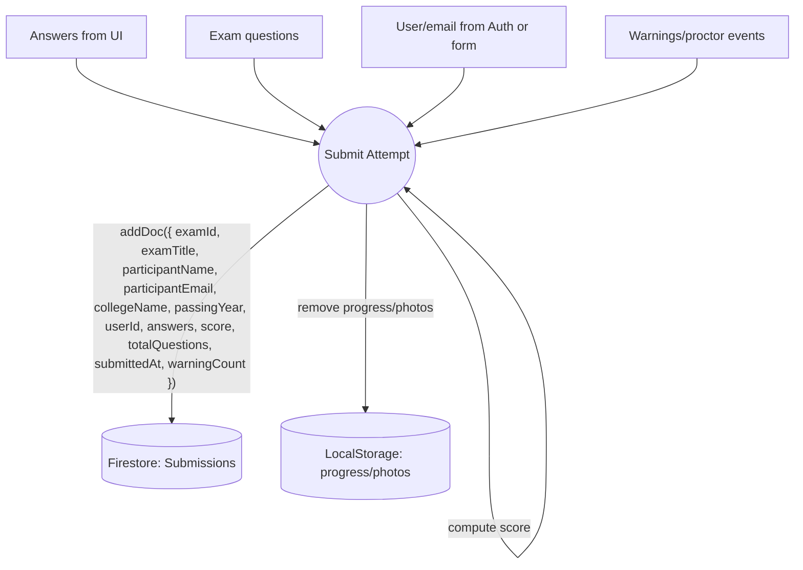

### Data Flow Diagrams (DFD)

This document provides Context (Level 0), Level 1, and a focused Level 2 data flow for the exam workflow in this project. Diagrams are rendered with Mermaid.

Legend (by shape/style):
- Rounded rectangle = Process
- Cylinder = Data store
- Rectangle with thin border = External entity
- Dotted clusters = Trust boundaries


### Context Diagram (Level 0)

```mermaid
flowchart LR
  %% Trust boundaries
  subgraph Client[Browser Clients]
    direction TB
    E1[Student]
    E2[Organizer/Admin]
  end

  subgraph System[Your App + Firebase (System of Interest)]
    direction TB
    P0((ProctorLink Web App))

    subgraph FB[Firebase Backend]
      direction TB
      DS1[(Firestore: Users)]
      DS2[(Firestore: Exams)]
      DS3[(Firestore: Submissions)]
      S1[[Firebase Auth]]
    end
  end

  E3[Google AI (Genkit Gemini)]:::external

  %% Flows
  E1 -- Login/Details/Answers --> P0
  E2 -- Create/Manage Exams --> P0

  P0 <-- Auth session / onAuthStateChanged --> S1
  P0 <--> DS1
  P0 <--> DS2
  P0 <--> DS3

  P0 <--> E3

  classDef external fill:#fff,stroke:#888,stroke-width:1px,color:#111
```


### Level 1: Organizer/Admin Flows

```mermaid
flowchart LR
  %% Actors
  E2[Organizer/Admin]:::external
  E3[Google AI (Genkit Gemini)]:::external

  %% Processes
  P1((Authenticate & Authorize))
  P2((Exam Builder))
  P3((Exam Management))

  %% Data stores
  DS1[(Users)]
  DS2[(Exams)]
  DS3[(Submissions)]

  %% Flows
  E2 -- Credentials --> P1
  P1 -- role/profile --> DS1
  P1 -- allow/deny --> E2

  E2 -- exam meta (title,tags,settings) --> P2
  P2 -- prompt(topic,difficulty,count) --> E3
  E3 -- generated questions/description --> P2
  P2 -- save exam --> DS2

  E2 -- pause/resume/copy/delete --> P3
  P3 -- update metadata --> DS2
  P3 -- fetch participant count --> DS3

  classDef external fill:#fff,stroke:#888,stroke-width:1px,color:#111
```


### Level 1: Student Flows




### Level 2: Submit Attempt (Scoring & Persistence)




### Data Stores (Quick Reference)
- Users: `users/{uid}` — email, role (`student|organizer|both`), admin flag, profile fields (name, college, graduationYear)
- Exams: `exams/{examId}` — title, description, tags, questions[], timeLimit/perQuestionTimer, allowedAttempts, expiryDate, restrictToEmails, allowedEmails[], createdAt, isPaused
- Submissions: `submissions/{submissionId}` — examId, examTitle, participantName, participantEmail, collegeName, passingYear, userId?, answers[], score, totalQuestions, submittedAt, warningCount
- Referral Codes: `referralCodes/{id}` — code (used in admin tool)

Notes:
- Identity verification photos and in-progress exam state are client-only (LocalStorage) and not persisted to Firestore.
- AI content generation uses Genkit with Google AI (Gemini) and does not store model responses unless included in saved exams.
