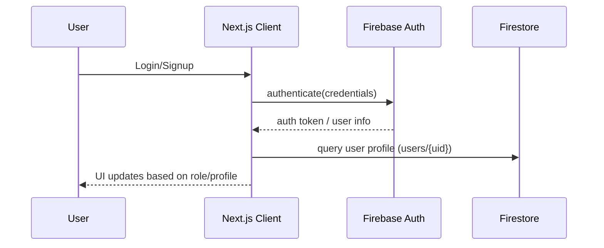
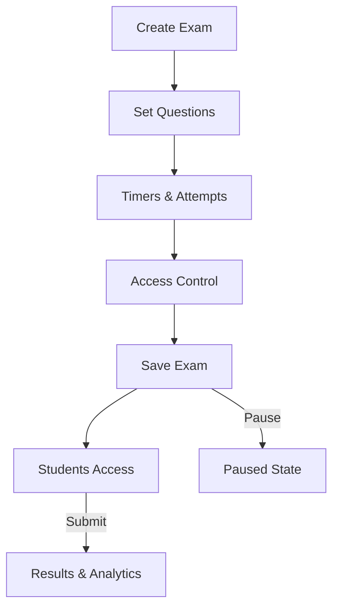
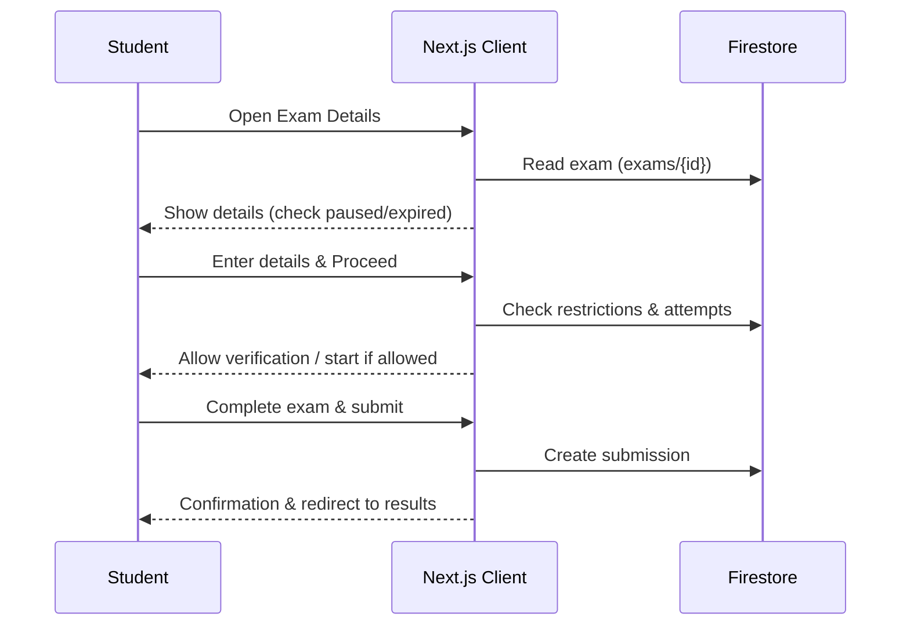
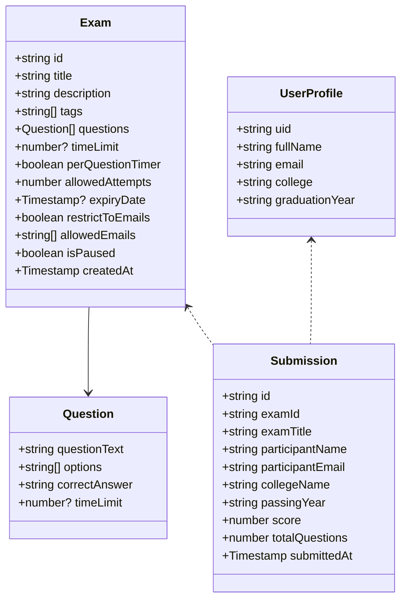
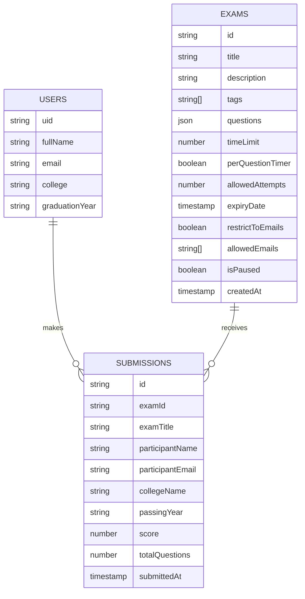

# ProctorLink - Platform Documentation

This document is a comprehensive, living reference for the ProctorLink platform. It covers product scope, features, architecture, data models, flows, APIs (client ↔ Firebase interactions), security, deployment, and a forward-looking roadmap. Diagrams are included in Mermaid format (viewable in many IDEs and markdown renderers).

## 1. Product Overview

- ProctorLink is a secure online examination platform with organizer (admin) and student roles.
- Organizers (admins) can create, manage, and analyze exams with AI-assisted tools.
- Students can take exams, view results, and receive tailored learning and career guidance in the Grow & Career Hub.
- The system uses Firebase (Firestore) for data persistence and Next.js (App Router) for the web front-end.

## 2. Key Features

- Organizer/Admin
  - Create/edit/pause exams with questions, timers (global or per question), attempts, expiry, tags.
  - Restrict access to specific email addresses.
  - View submissions and analytics per exam.
  - AI tools: question generation and description generation.
- Student
  - Login/signup, profile management.
  - Dashboard with past submissions and performance stats.
  - Available exams list respects access rules (restriction and pause state; expired can be optionally filtered).
  - Exam taking with limits and verification steps.
  - Grow & Career Hub: recommended courses, learning path generator, resume improvement, AI interviews, practice quizzes, interview question bank, career roadmaps (initial placeholders + dynamic recommendations by exam tags for low scores).

## 3. High-Level Architecture

```mermaid
flowchart LR
  subgraph Client [Next.js App]
    A[UI Components / Pages]
    B[Auth Context]
    C[Hooks (toast, mobile)]
  end

  subgraph Backend [Firebase]
    D[Firestore]
    E[Authentication]
  end

  subgraph AI[Genkit / AI Flows]
    F[generate-exam-questions]
    G[generate-exam-description]
  end

  A <--> D
  A <--> E
  A <--> F
  A <--> G
  B --> E
  C --> A
```

- UI built with React + Next.js App Router in `src/app/`.
- State via React hooks and minimal context (`AuthContext`).
- Firestore stores users, exams, and submissions; Authentication stores user identity.
- AI utilities reside in `src/ai/` using Genkit flows.

## 4. Directory Structure (Relevant)

- `src/app/`
  - `dashboard/` (organizer UI)
  - `exam/[id]/` (exam details, verify, and take flows)
  - `student/` (student-facing dashboard, profile, skills hub)
  - `legal/` (privacy, terms)
  - `login/`, `signup/` (auth)
- `src/components/ui/` (design system components)
- `src/context/AuthContext.tsx` (auth state)
- `src/lib/firebase.ts` (Firebase config)
- `src/lib/rbac.tsx`, `src/lib/utils.ts` (helpers)
- `src/ai/flows/` (AI flows)

## 5. Data Model (Firestore)

Collections and their typical fields. Firestore is schemaless; this is the intended schema contract.

### 5.1 Users (`users/{uid}`)
- `fullName: string`
- `email: string` (usually from auth; immutable in profile UI)
- `college: string`
- `graduationYear: string`
- Additional role/metadata fields can be added as needed.

### 5.2 Exams (`exams/{examId}`)
- `title: string`
- `description: string`
- `tags: string[]`
- `questions: { questionText: string; options: string[]; correctAnswer: string; timeLimit?: number }[]`
- `timeLimit: number | null` (null if per-question timer enabled)
- `perQuestionTimer: boolean`
- `allowedAttempts: number`
- `expiryDate: Timestamp | null`
- `restrictToEmails: boolean`
- `allowedEmails: string[]` (emails lowercased/trimmed)
- `isPaused: boolean` (optional; default false)
- `createdAt: Timestamp`

### 5.3 Submissions (`submissions/{submissionId}`)
- `examId: string`
- `examTitle: string`
- `participantName: string`
- `participantEmail: string`
- `collegeName: string`
- `passingYear: string`
- `score: number`
- `totalQuestions: number`
- `submittedAt: Timestamp`

## 6. Access and Visibility Rules

- Available exams for a student:
  - Public: `restrictToEmails == false` (or field missing)
  - Restricted: `restrictToEmails == true` AND `allowedEmails` contains `student.email`
  - Paused: excluded from availability (`isPaused === true`)
  - Expiry: current logic supports expiry detection in details page; optional pre-filter in list (can be added).

- Start-exam checks:
  - Paused/Expired -> prevent start.
  - If restricted, validate `email` ∈ `allowedEmails`.
  - Attempts check: if prior submissions count ≥ `allowedAttempts`, block start.

## 7. Authentication Flow



- `AuthContext` maintains `user` for client components.
- Student profile page loads `users/{uid}` and allows editing certain fields.

## 8. Exam Lifecycle (Organizer)

1. Create exam with title, description, tags, questions (manual/AI), timers, attempts, expiry.
2. Set access control: public or restricted by emails.
3. Publish (implicitly by creating; pause/unpause via `isPaused`).
4. Monitor results: participant count, submissions list, scoring.



## 9. Exam Taking Flow (Student)



## 10. Grow & Career Hub

- Centralized student growth area with reusable layout: sticky header, breadcrumbs, footer.
- Pages:
  - `/student/skills` (hub landing)
  - `/student/skills/courses` (Recommended Courses – dynamic per low-score tags + curated content)
  - `/student/skills/path` (Learning Path Generator)
  - `/student/skills/resume` (Resume Improvement)
  - `/student/skills/interview` (AI Mock Interviews)
  - `/student/skills/quiz` (Practice Quizzes)
  - `/student/skills/questions` (Interview Question Bank)
  - `/student/skills/roadmap` (Career Roadmaps)

- Dynamic recommendations: the hub analyzes the student’s submissions; for scores < 60%, it fetches associated exam tags and builds a frequency map to recommend topics to improve.

```mermaid
flowchart LR
  SUBS[Submissions (user)] -->|<60%| TAGS[Fetch Exam Tags]
  TAGS --> AGG[Aggregate Topics]
  AGG --> UI[Recommended Topics]
```

## 11. Client-Firebase Interactions (APIs)

There is no separate backend API server; the client interacts directly with Firebase services.

- Authentication (Firebase Auth): standard email/password or other providers (extendable).
- Firestore reads/writes:
  - Exams: `collection('exams')`, `getDocs`, `getDoc`, `addDoc`, `query`, `where`, `orderBy`.
  - Submissions: `collection('submissions')`, `getDocs`, `getCountFromServer` for attempt counts.
  - Users: `doc('users', uid)`, `getDoc`, `updateDoc`.

Example operations used in the app:
- Fetch all exams (dashboard): `query(collection(db,'exams'), orderBy('createdAt','desc'))`
- Count participants per exam: `getCountFromServer(query(collection(db,'submissions'), where('examId','==', examId)))`
- Student submissions: `query(collection(db,'submissions'), where('participantEmail','==', user.email))`
- Available exams:
  - Public: `where('restrictToEmails','==', false)`
  - Restricted: `where('restrictToEmails','==', true)`, `where('allowedEmails','array-contains', user.email)`

## 12. Security & Privacy

- Exam restrictions by email (whitelist).
- Attempt limits enforced client-side with Firestore count queries.
- Paused/expired exam guards in UI.
- Student personal data stored in `users/{uid}`; email is immutable in UI.
- Consider server-side security rules in Firestore to prevent unauthorized reads/writes:
  - Read access to `exams` public fields.
  - Restricted exam fields should be readable by allowed users (or sensitive data separated if needed).
  - Writes restricted to authenticated users + role checks for admin endpoints.

## 13. Roles and RBAC

- Current implementation: implicit roles by route. Organizers access `/dashboard` area; students access `/student`.
- `src/lib/rbac.tsx` can evolve to explicit claims in Firebase Auth.
- Future: add custom claims (admin/student) and gate routes and writes accordingly.

## 14. UI Routes (Summary)

- Public: `/`, `/legal/terms`, `/legal/privacy`
- Organizer: `/dashboard`, `/dashboard/create`, `/dashboard/edit/[id]`, `/dashboard/results`
- Exams: `/exam/[id]`, `/exam/[id]/verify`, `/exam/[id]/take`
- Student: `/student/dashboard`, `/student/profile`, `/student/dashboard/submission/[id]`
- Career Hub: `/student/skills` + subpages listed in section 10

## 15. Component Overview

```mermaid
flowchart TD
  UI[UI Components] --> P[Pages]
  P --> C[Context: Auth]
  P --> H[Hooks: toast]
  P --> FBF[Firebase (db, auth)]
  P --> AI[AI Flows]
```

- `components/ui/*` includes a design system based on shadcn/ui components.
- `AuthContext` exposes `user` to client components.

## 16. Low-Level Design (LLD) – Key Types

TypeScript model sketch for major shapes (conceptual, not generated code):



## 17. Critical Flows (Sequences)

### 17.1 Start Exam Flow (Restricted + Attempts)
```mermaid
sequenceDiagram
  participant S as Student
  participant FE as Client
  participant FS as Firestore
  S->>FE: Fill details & submit
  FE->>FS: Read exam by id
  FE->>FS: Count submissions for (examId, email)
  alt attempts exceeded
    FE-->>S: Block with message
  else allowed
    alt restricted
      FE: Check email in allowedEmails
      alt not allowed
        FE-->>S: Access denied
      else allowed
        FE-->>S: Proceed to verification
      end
    else public
      FE-->>S: Proceed to verification
    end
  end
```

### 17.2 Career Hub Recommendations
```mermaid
sequenceDiagram
  participant S as Student
  participant FE as Client
  participant FS as Firestore
  S->>FE: Open Career Hub
  FE->>FS: Query submissions for user
  loop for each <60% submission
    FE->>FS: Fetch exam (tags)
    FE: Aggregate tags
  end
  FE-->>S: Show recommended topics and actions
```

## 18. Error Handling & UX

- Toast notifications for errors: Firestore read failures, save failures, invalid access, attempt overflows.
- Skeleton loaders on exam detail headers and metrics.
- Graceful fallbacks in Career Hub recommendations (dummy content if none available).

## 19. Performance Considerations

- Avoid expensive Firestore queries with composite indexes where possible; prefer separate queries.
- For recommendations, consider limiting to recent N submissions or caching.
- Use client-side sorting for small data sets; server-side aggregation if data grows.

## 20. Deployment & Configuration

- Next.js app with typical App Router deployment.
- Firebase project with Firestore and Auth enabled.
- `.env` variables loaded via `src/lib/firebase.ts` (ensure keys configured properly in that file).
- Build steps: install deps, build, run.

## 21. Security Rules (Suggested Starting Point)

Example (pseudocode) Firestore rules to be adapted in the Firebase console:

- Users can read/update their own `users/{uid}` docs.
- Exams readable by all; for restricted fields/flows consider separate protected subcollections.
- Submissions create allowed by authenticated users; read allowed by exam organizer and the participant.

## 22. Testing Strategy

- Unit tests for pure utilities.
- Integration tests for flows with Firestore emulator (future).
- E2E tests: create exam → take → results.

## 23. Future Roadmap

- Server-side role-based access control (custom claims) and route guards.
- Server functions to enforce attempts and restrictions securely.
- Proctoring enhancements: camera stream validation, tab change detection, AI anomaly detection.
- Analytics dashboards: cohort stats, topic breakdowns, trend analysis.
- Career Hub:
  - Real course integrations (Coursera/Udemy/internal content)
  - Learning path AI agent with milestone tracking
  - Resume parser and ATS scoring
  - Full AI mock interview with audio/video and feedback transcripts
  - Practice quizzes bank tied to tags and difficulty
  - Interview question bank with community curation
  - Career roadmaps with skill graph linking to resources
- Internationalization and accessibility expansions.

## 24. Appendix – Firestore ER Diagram (Conceptual)



---
This documentation is intended to be exhaustive yet maintainable. Keep it updated as the product evolves.

